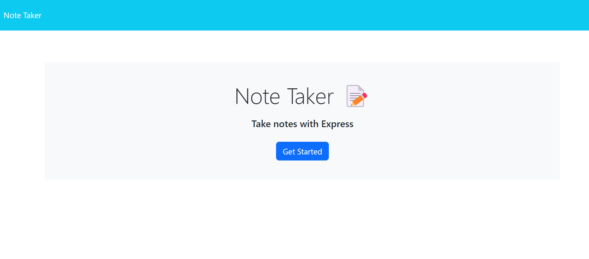
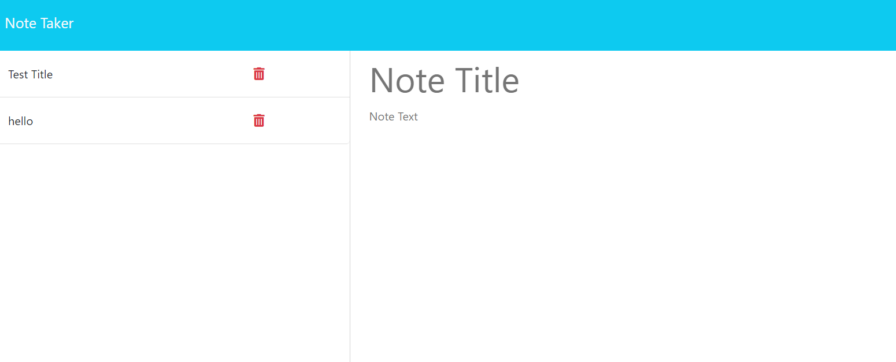
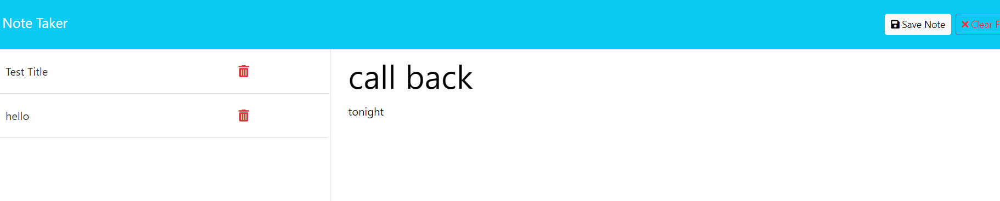
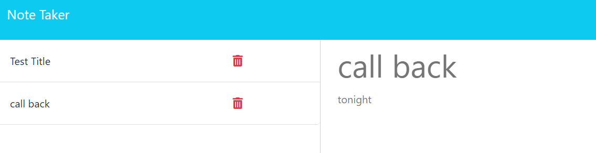
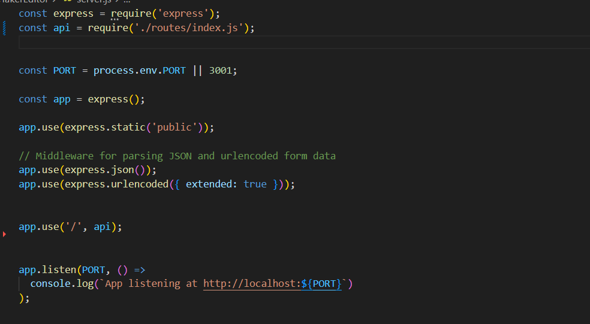
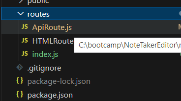
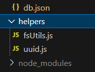
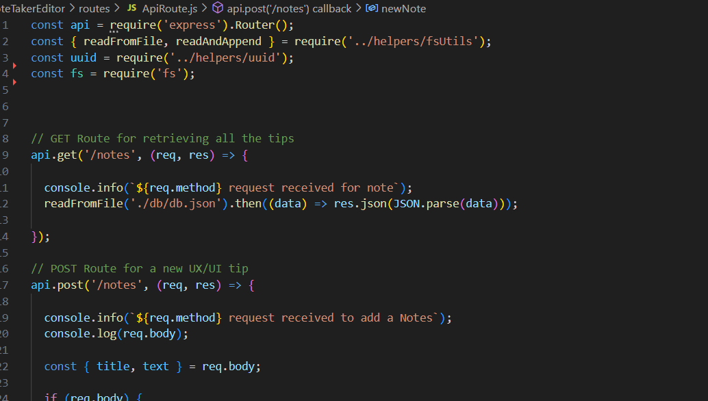
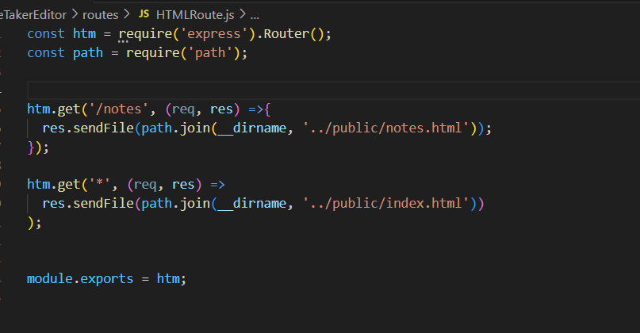
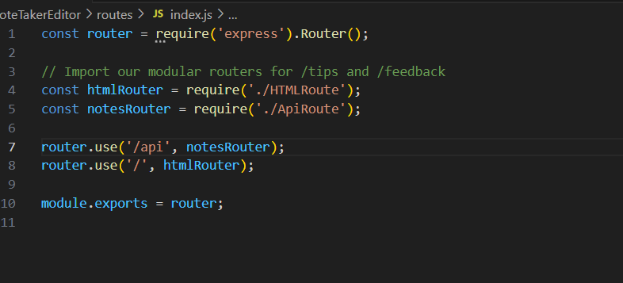

# NoteTakerEditor

## Table of Contents (Optional)

- [Description](#description)
- [Installation](#installation)
- [Usage](#usage)
- [Credits](#credits)
- [License](#license)

## Description

I learn express and how to work with server , I learn how to test the code before I run it inside the project and how to coonect between server and index.js using res.get(),res.post() and fecth() ,I build this project to add , review and delete notes

- What problem does it solve?
1- add landing page with a link to a notes page
2- when user click on notes page button , it will show another page include empty text notes on the right side and list for exist notes on left side.
3- when user click on text note , webpage will show save button on the right corner with clear button too
4- when user click on save button , webpage will save it to jSON data and return,add it to the left-side-list
5- when user click on an existing note, the old note will show on the right side
6- when user click on a new note button , the text on the right side will clear it , so user can add another notes

## Installation

the project has two installation process one for (package.json) and it's install using this command in terminal "npm init"
another process is (node_modules) 

## Usage
when webpage open will show landing page , then click on the notes page button. the new page will show the page help to add , reviwe and delete notes 

github :  https://github.com/omeraus6/NoteTakerEditor

image 1: landing page

image 2: note taker page

image 3: save "call back" note

image 4: delete "hello" note

image 5: server,js code

image 6: Routes js files

image 7: helper code

image 8: 

image 9: 

image 10: image 8-10 : code

 

## Credits

Thank you for tips and sugestion from Bootcamp instructors and classmates, I hava used https://www.w3schools.com/ , https://stackoverflow.com/ and https://developer.mozilla.org/en-US/docs/Web/CSS/grid-template to reserch information 

## License

Please refer to the LICENSE in the repo.